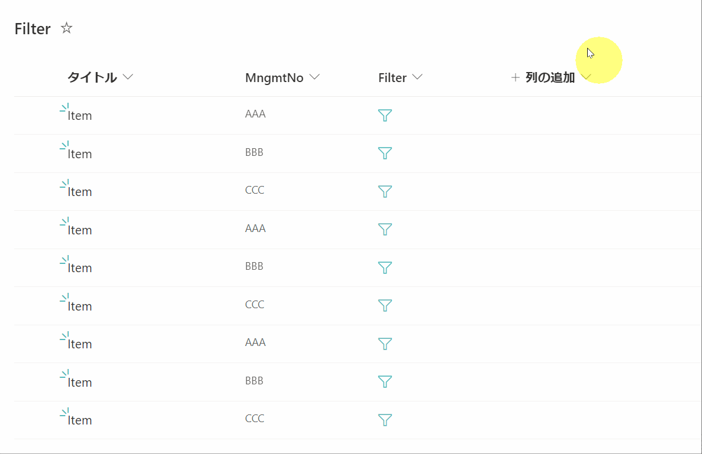
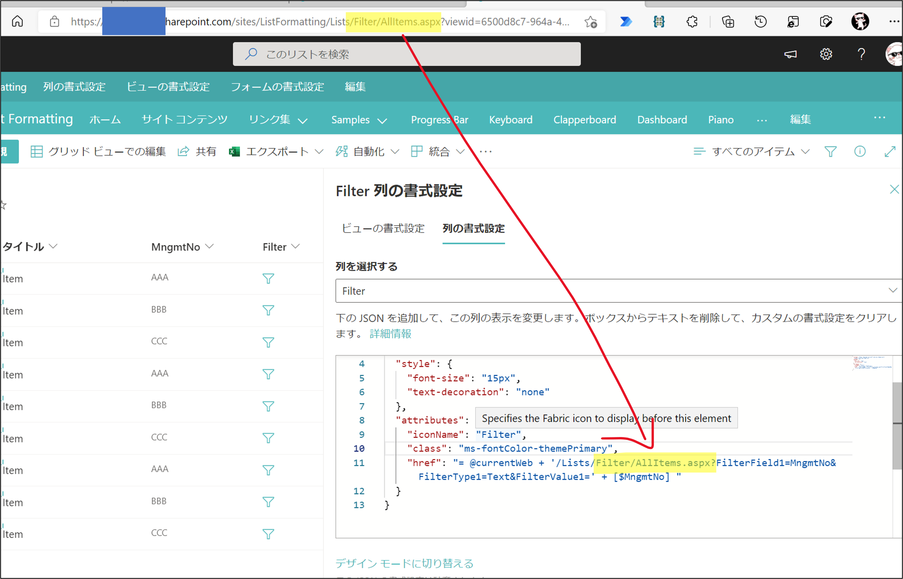
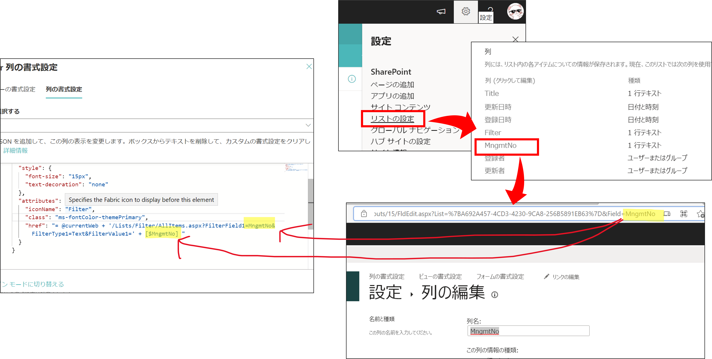

# フィルターをする列の書式設定

## サンプル



## JSON

```
{
  "$schema": "https://developer.microsoft.com/json-schemas/sp/v2/column-formatting.schema.json",
  "elmType": "a",
  "style": {
    "font-size": "15px",
    "text-decoration": "none"
  },
  "attributes": {
    "iconName": "Filter",
    "class": "ms-fontColor-themePrimary",
    "href": "= @currentWeb + '/Lists/<<リストの内部名>>/<<ビュー名>>.aspx?FilterField1=<<フィルターしたい列の内部名>>&FilterType1=Text&FilterValue1=' + [$<<フィルターしたい列の内部名>>] "
  }
}
```

リスト名 `Filter` の ビュー `AllItems` で、列 `MngmtNo` の値でフィルターしたい場合

```
{
  "$schema": "https://developer.microsoft.com/json-schemas/sp/v2/column-formatting.schema.json",
  "elmType": "a",
  "style": {
    "font-size": "15px",
    "text-decoration": "none"
  },
  "attributes": {
    "iconName": "Filter",
    "class": "ms-fontColor-themePrimary",
    "href": "= @currentWeb + '/Lists/Filter/AllItems.aspx?FilterField1=MngmtNo&FilterType1=Text&FilterValue1=' + [$MngmtNo] "
  }
}
```

## JSON の修正

自身の環境のリストでこの書式設定を利用する場合は、JSONの修正が必要です。



