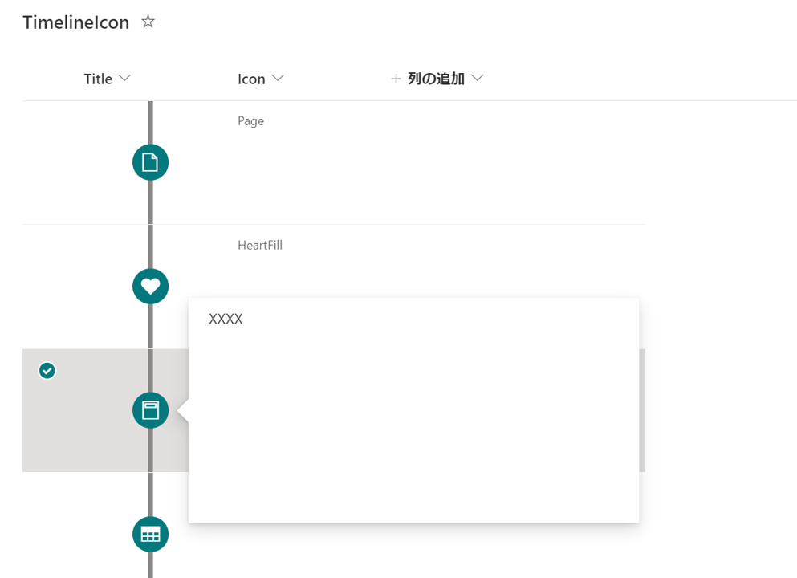

# Timeline with icons

## Summary

Displays a timeline with icons in a circle.

## View requirements

|Type                               |Internal Name         |
|-----------------------------------|----------------------|
|Single line of text(Anything goes) |Title(Anything goes.) |
|Single line of text or Choice      |Icon                  |

In the `Icon` column, enter the icon name of [Fluent UI Icons](https://developer.microsoft.com/ja-JP/fluentui#/styles/web/icons).