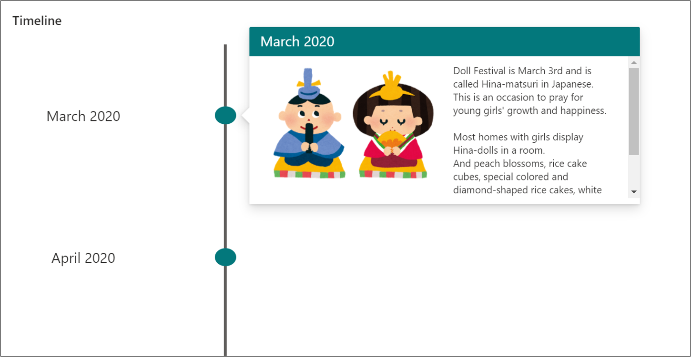
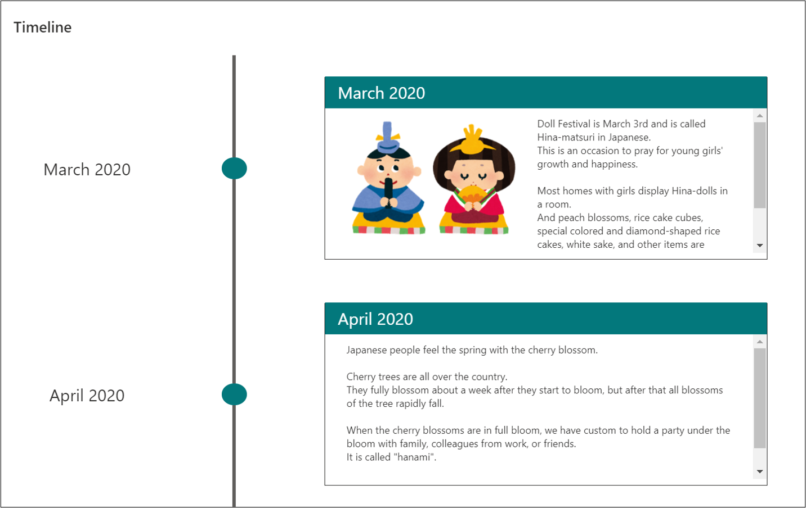
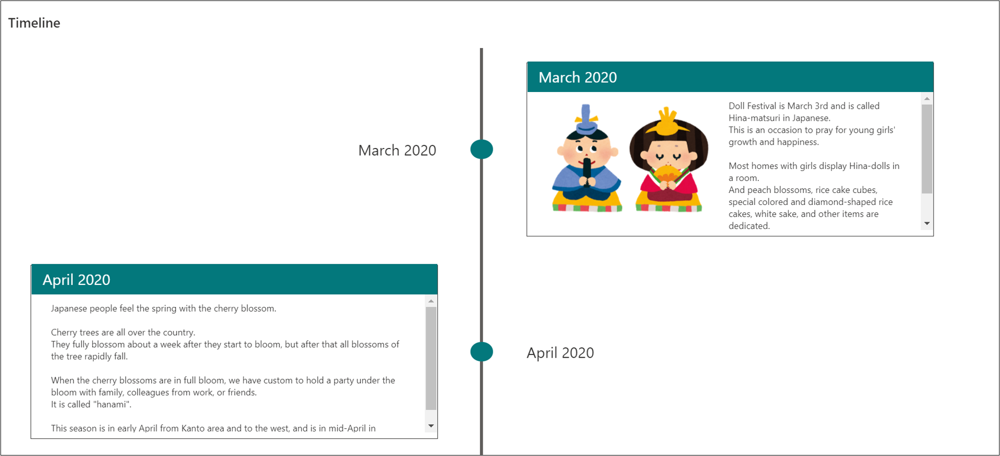
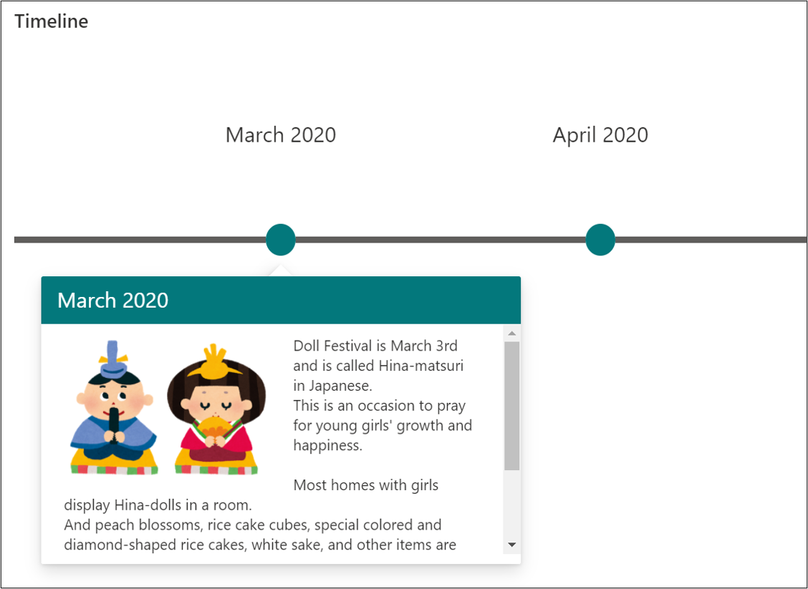
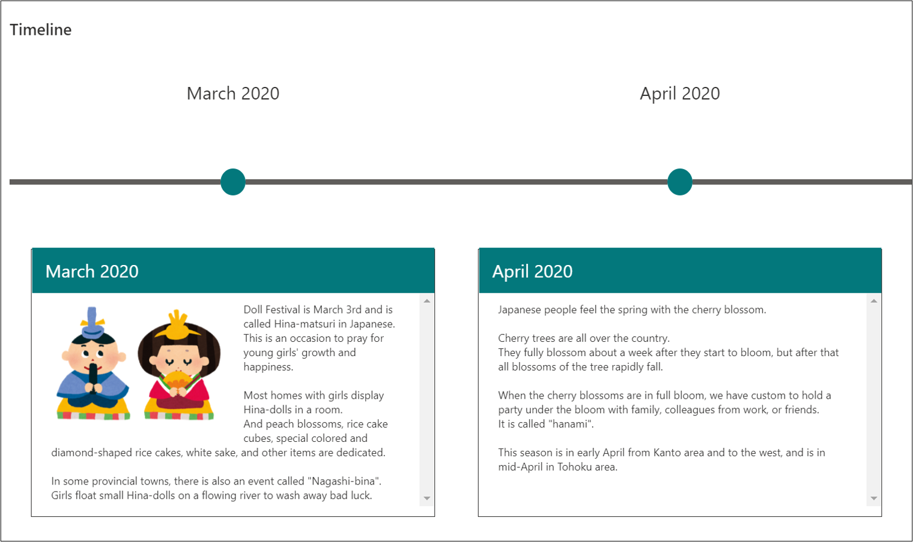

# Timeline Format

## Summary
This sample formats your SharePoint list view to look like a timeline.

## View requirements

The view must include these columns:

Column Name   |Type
--------------|--------------
Title         | Single Line Text
Description   | Multi Line Text
Image         | Image

## Vertical Timeline Format Sample

### Vertical Timeline Format Sample 1

Click on the circle to see the description.

### Vertical Timeline Format Sample 2

The description is always displayed.

### Vertical Timeline Format Sample 3

The description is always displayed. Also, the explanation is displayed alternately on the left and right.

## Horizontal Timeline Format Sample

### Horizontal Timeline Format Sample 1

Click on the circle to see the description.

### Horizontal Timeline Format Sample 2

The description is always displayed.

### Horizontal Timeline Format Sample 3

The explanation is always displayed. The description is always displayed, and alternates between the top and bottom.

