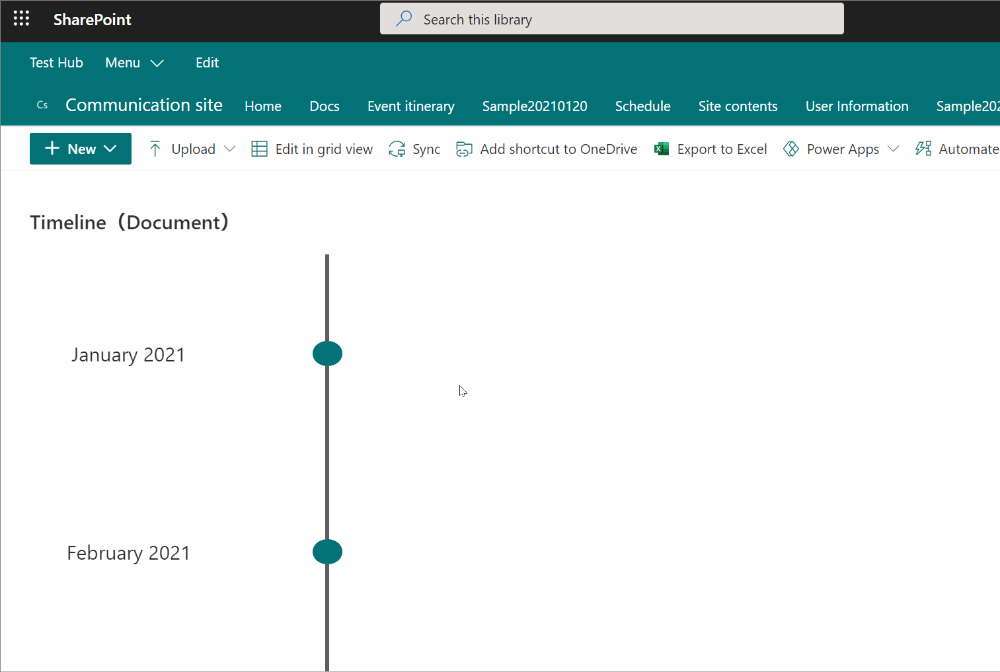

# Timeline Format

## Summary
This sample formats your SharePoint list view to look like a timeline.

## View requirements

The view must include these columns:

Column Name   |Type
--------------|--------------
Date          | Single Line Text
DrugName      | Single Line Text
Description   | Multi Line Text

