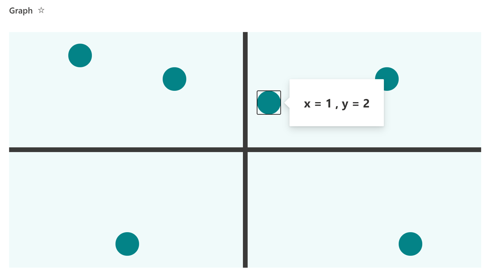

# XY Graph

## Summary

This is the formatting that turns the view into an xy graph. It is assumed that x is entered from -9 to 9 and y is entered from -4 to 4.

## View requirements

|Type                |Internal Name|Required|
|--------------------|-------------|:------:|
|Number              |x            |Yes     |
|Number              |y            |Yes     |